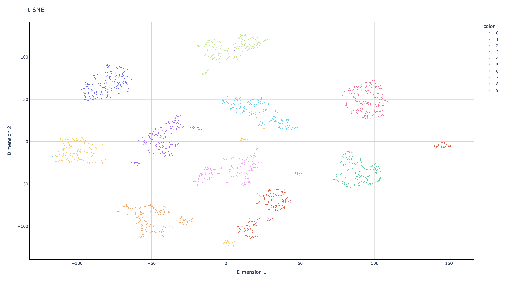
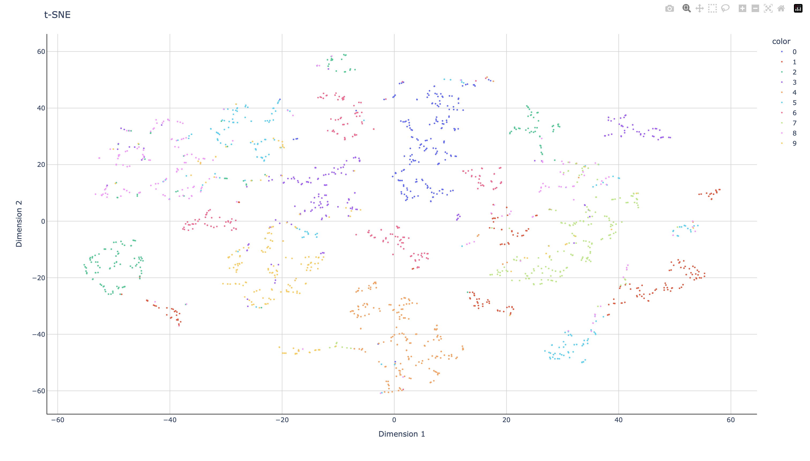

# Дерево решений

> алгоритм - CART (Classification and Regression Tree)

## Зависимости

- scikit-learn== 1.5.2
- pandas==2.2.3
- matplotlib==3.9.2
- loguru==0.7.2
- pydantic==1.10.10
- pydantic[dotenv]==1.10.10

## Результаты

Верно предсказано - 90%

На обучение использовалось 60% датасета

## Датасет

Для обучения был использован датасет Ad Click Prediction

В нем были данные о том, нажмет ли клиент на объявление и совершит ли покупку

Этот набор данных содержит следующие данные:

- "User ID": уникальная идентификация потребителя
- "Age": возраст клиента в годах
- "Estimated Salary": Средний доход потребителя
- "Gender": Был ли потребитель мужчиной или женщиной
- "Purchased": 0 или 1 указано при нажатии на объявление.

[Ссылка на датасет](https://www.kaggle.com/datasets/jahnveenarang/cvdcvd-vd)

# t-SNE

готовый алгоритм из slylearn:

собственный алгоритм:

Метрики:

- Точность: 0.99
- Полнота: 0.47
- Выпады: 0.01
- F-мера: 0.64